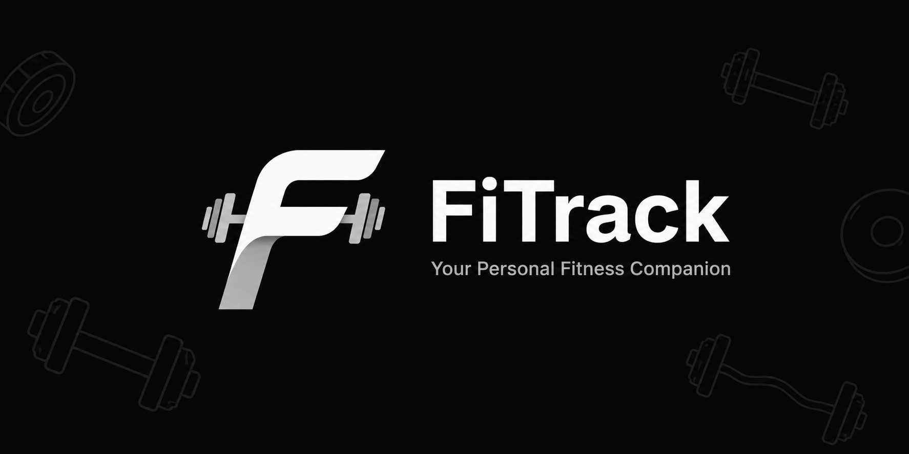
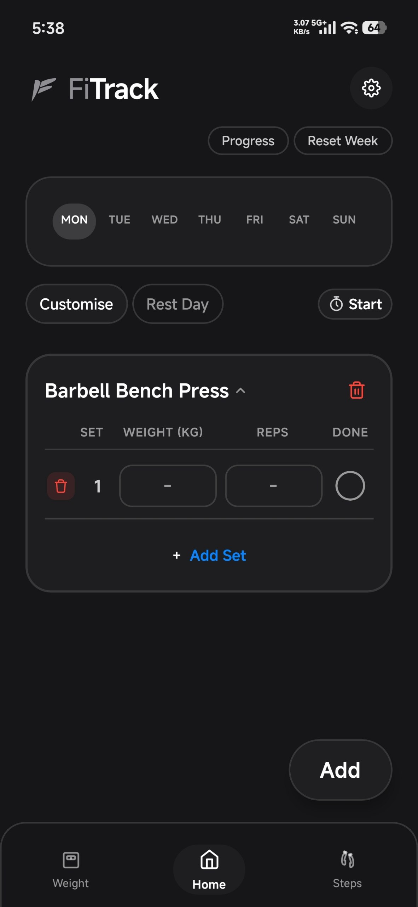
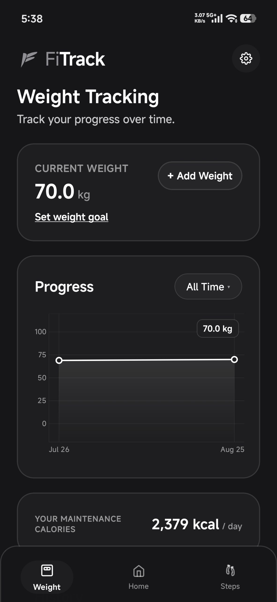
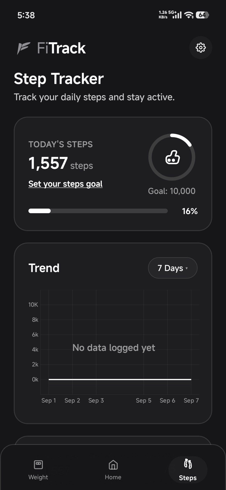

# FiTrack

### A simple, fitness tracker for your everyday training.

Track your workouts, monitor your progress, and understand your training without turning your gym routine into a spreadsheet.

**FiTrack** helps you log workouts, exercises, sets, reps, weights, body weight, and daily steps, all in one clean, dark interface built for the gym.

  

---

##  Screens

  
  
  

---

##  Download FiTrack

  

  
  

---

## ✨ Features

###  Workout Tracking

Log your training as you go.

- Track exercises, sets, reps, and weight
- Build and customize workouts
- Mark sets as completed in real time
- Create your own exercises
- Keep a history of your training

###  Progress & Analytics

Turn your workout history into useful insights.

- Track personal records
- View workout statistics
- Analyze muscle group distribution
- Monitor your progress over time
- Visualize your training data

###  Weight Tracking

Keep an eye on your body-weight progress.

- Log weight measurements
- View weight changes over time
- Visualize your progress with charts

###  Step Tracking

Keep your daily activity in one place.

- Track daily steps
- Set step goals
- Monitor your progress toward your goals

###  Built for the Gym

FiTrack uses a dark, minimal interface designed to stay comfortable in a gym environment.

No clutter. No unnecessary complexity. Just the information you need while training.

---

##  Why FiTrack?

Most fitness trackers try to do everything.

FiTrack focuses on the things you actually need to stay consistent:

**Log your workout → Track your progress → Get stronger.**

The goal is simple: make recording a workout fast enough that it doesn't become another chore.

---

##  Roadmap

FiTrack is actively being developed.

- Premium features
- Advanced workout insights
- More detailed progress analytics
- Workout templates and routines
- Improved exercise statistics
- Additional customization options

---

##  Contributing

Contributions, ideas, and bug reports are welcome.

If you find a bug or have an idea that could make FiTrack better, open an issue or submit a pull request.

---

##  License

FiTrack is open source and available under the [MIT License](LICENSE).

---

##  Support the Project

If FiTrack is useful to you, consider giving the repository a star on GitHub.

It helps the project get discovered and motivates continued development.

  <a href="https://github.com/AyushSaha184/FiTrack">
    ⭐  FiTrack on GitHub
  </a>

